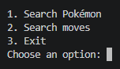
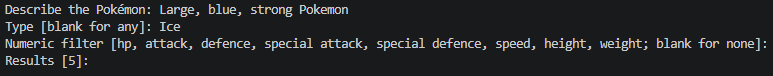
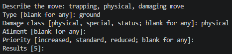
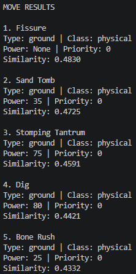

# Poke-Teach ETL Pipeline
## Overview
Loading Pokémon data from PokeAPI using Pymongo and hosting on S3. This data is used to perform a semantic search using FAISS indexes from the vector embeddings obtained from the search documents for each Pokemon. These were all built from parsing the exported JSON files.

## Table of Contents
- [Pipeline Worflow](#pipeline-workflow)
- [Data Model](#data-model)
- [Setup Instructions](#setup-instructions)
- [Usage](#usage)
- [Technical Decisions](#technical-decisions)
- [Future Improvements](#future-improvements)
- [Team Members](#team-members)
- [License](#license)

---

## Pipeline Workflow


## Data Model
### Pokémon Collection

| Field | Type | Description | Reasoning |
|-------|------|-------------|-----------|
| `id` | Integer | Unique Pokémon ID | Primary key and API reference |
| `name` | String | Pokémon name | Primary search field |
| `types` | Array | Pokémon types (e.g., Fire, Water) | Type-based filtering and recommendations |
| `abilities` | Array | Abilities with name and effect | Searchable field for ability queries |
| `height_m` | Integer | Height in meters | Physical characteristic filter |
| `weight_kg` | Integer | Weight in kilograms | Physical characteristic filter |
| `stats` | Object | Base stats (HP, Attack, Defense, etc.) | Battle calculations and comparisons |
| `moves` | Array | List of learnable move names | Relationship mapping to moves collection |
| `sprites` | Object | URLs to Pokémon images; kept only `front_default` | Visual reference for future UI |

---

### Moves Collection

| Field | Type | Description | Reasoning |
|-------|------|-------------|-----------|
| `id` | Integer | Unique move ID | Primary key and API reference |
| `name` | String | Move name | Primary search field |
| `type` | String | Move type (e.g., Fire, Water) | Type-matching recommendations |
| `power` | Integer | Base power (null for status moves) | Damage calculation and recommendations |
| `accuracy` | Integer | Accuracy percentage (null for always-hit) | Move reliability assessment |
| `pp` | Integer | Power points (usage limit) | Usage limitation for strategy |
| `priority` | Integer | Move priority (negative/positive) | Turn order determination |
| `damage_class` | String | "physical", "special", or "status" | Stat usage categorization |
| `target` | String | Target selection (e.g., "selected-pokemon") | Strategic considerations |
| `effect_entries` | Object | Short effect description in English | Semantic search descriptions |
| `meta` | Object | Additional metadata (ailment, category, etc.) | Advanced filtering options |
| `learned_by_pokemon` | Array | List of Pokémon that learn this move | Relationship mapping to Pokémon collection |

### Data Selection Rationale
We worked backwards from our desired semantic search and recommendation queries to determine which fields to keep:
- **Search requirements**: Need name, type, and effect descriptions for text matching
- **Recommendation requirements**: Need stats, type matchups, and move effectiveness for suggesting optimal Pokémon/Moves

## Setup Instructions

### Prerequisites
- Python 3.8+
- MongoDB (local or Atlas)
- AWS Account with S3 access
- pip (Python package manager)

### Python Libraries
See `requirements.txt`

Main libraries used:
- `pymongo`,`requests`, `boto3`  for ETL
- `sentence-transformers`, `scikit-learn`, `faiss`, `numpy` for Semantic Search

### Installation

1. Clone the repository
```bash
git clone "https://github.com/Jordan-Marajh/Poke-Teach"
cd Poke-Teach
```

2. Create a virtual environment
```bash
python -m venv venv
source venv/Scripts/activate
```

3. Install dependencies
```bash
pip install -r requirements.txt
```

4. Start MongoDB (optional)
```bash
# Start MongoDB (if not already running)
mongod
```

## Usage

### ETL Pipeline
```bash
# Run the ETL pipeline
python main.py
```

Details of the pipeline:

```bash
# Extract data from Pokemon API into MongoDB
python etl/import_poke_data.py

# Keep relevant fields from the Pokemon and Move collections
python etl/drop_poke_data.py

# Filtering and reformatting to flatten the data 
python etl/transform_poke_data.py

# Download the sprites for the UI 
python etl/download_sprites.py

# Upload to S3
python etl/upload_s3.py
```

### Semantic Search

For now, this is very limited in scope and handles basic queries about Pokemon and moves.

Instructions on how to use the transformed data to search:

Run `py semantic_search/semantic_search.py` in Git Bash.

You'll be given 3 options from the menu, 1. Search Pokemon, 2. Search moves and 3. Exit.



1. Search Pokemon:
- Describe the Pokemon you want to find.
- Type: Specify the Pokemon type(s).
- Numeric filter: If you know any of the statistics, write them here.
- Display results: Enter an integer n between 1 and 5. Default is 5.

> **_Search Pokemon example:_** 
>
> 

Should display a list of the top n Pokemon matching your search.

> **_Example output:_** 
>
> 

2. Search moves:
- Describne the move you want to find.
- Type: Specify the move type.
- Damage class, Ailment, Priority: If you know them, write them when prompted.
- Display results: Enter an integer n between 1 and 5. Default is 5.

> **_Search Moves example:_** 
>
> 


Should display a list of the top n moves matching your search.

> **_Example output:_** 
>
> 

## Technical Decisions

### Why Pokémon API?
- Rich dataset with clear relationships
- Well-documented REST API
- No authentication required
- Large community of users

### Why These Collections?
- Pokémon and Moves provide natural relationship (Pokémon use Moves, Moves can be learnt by many Pokémon)
- Easy to demonstrate semantic search (e.g., "show me fire-type Pokémon with high speed")
- Can extend to include other collections if needed

### Data Transformation Approach
- Normalised nested objects from API into flat documents for MongoDB
- Used existing JSON structure to maintain relationships

### Downloading Sprites
The project includes a utility script to download all Pokémon `default_front` sprites for potential visual display.

Why we included this:
- The script dynamically gets the total number of Pokémon from the API, so it works with any current or future Pokémon count
- Saves images as {pokemon_id}.png for easy lookup
- Local copies or hosting on S3 ensure we're not dependent on external URLs that could change or break over time

To run:
```bash
pip install requests  # If not already installed
python download_sprites.py
```

> This will create a sprites/ folder and download all available Pokémon sprites; it includes a small delay between requests to respect PokeAPI's rate limits.

## Future Improvements
- Add more Pokémon collections (Abilities, Items, etc.)
- Implement more sophisticated recommendation algorithms
- Add caching layer for API calls
- Create a web interface/GUI for search
- Use a better trained LLM for semantic search

## Team Members
- Jordan Marajh
- Sarah Hasan

## License
MIT License